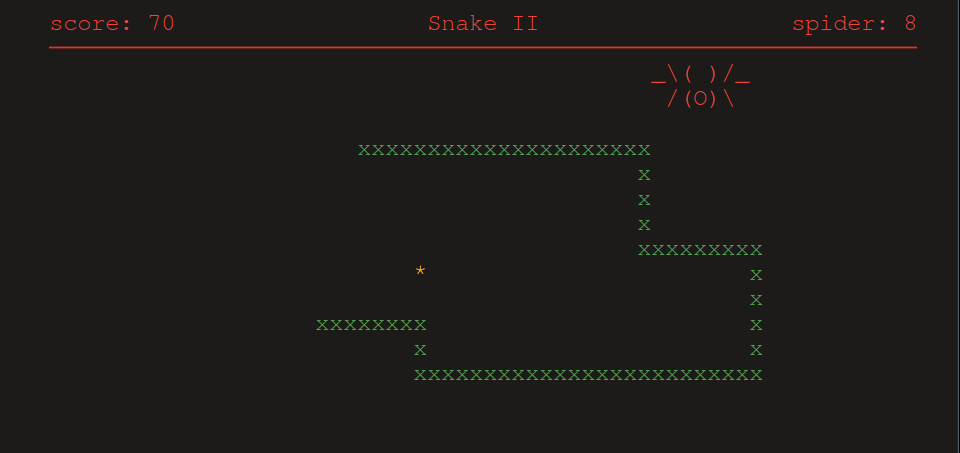

# Snake Game

## Overview

Slither into nostalgia with Snake II: Linux Edition, a classic port straight from the iconic Nokia 3310, this port brings back the thrill of the 90s right to your Linux terminal.



## Features

- **Bounded Play Area**: Enjoy the game within a visually appealing, bordered play area that keeps the snake contained.
- **Score Tracking**: Keep track of your score as you devour food items. Can you beat your high score?
- **Timer**: A dynamic timer adds an extra layer of excitement, challenging you to eat as much food as possible within a limited time.
- **Game Over Screen**: When the game ends, a vibrant game over screen displays your final score and options to restart or quit.
- **Modal Menu**: A sleek modal menu pops up upon game over, offering convenient options to restart or quit the game.
- **Customizable Colors**: Personalize your gaming experience with customizable colors for the snake, food, and game borders.

## Usage

1. **Compile the Source Code**: Compile the `main.cpp` source code using any C++ compiler with support for the curses library.

    ```bash
    g++ main.cpp -o snake_game -lncurses
    ```

2. **Run the Game**: Execute the compiled binary to start playing the game.

    ```bash
    ./snake.out
    ```

    Optionally, add the `bounded` flag to enable the bounded play area feature.

    ```bash
    ./snake.out bounded
    ```

## Controls

- **Arrow Keys**: Use the arrow keys to control the movement of the snake (up, down, left, right).
- **Quit**: Press 'Q' to quit the game at any time.
- **Restart**: Upon game over, press 'R' to restart the game or 'Q' to quit.

## Dependencies

- **ncurses Library**: The game relies on the curses library for terminal-based user interface handling.

## Contributing

We welcome contributions to make the Snake Game even better! Fork the repository, make your enhancements, and submit a pull request. If you encounter any issues or have suggestions for improvements, please open an issue on the GitHub repository.

## License

This project is licensed under the [MIT License](LICENSE).

## Acknowledgements

- Inspired by the classic Snake game, this project was made possible by the support and contributions of the open-source community.
- Special thanks to the developers of the curses library for providing a powerful tool for creating terminal-based user interfaces.
